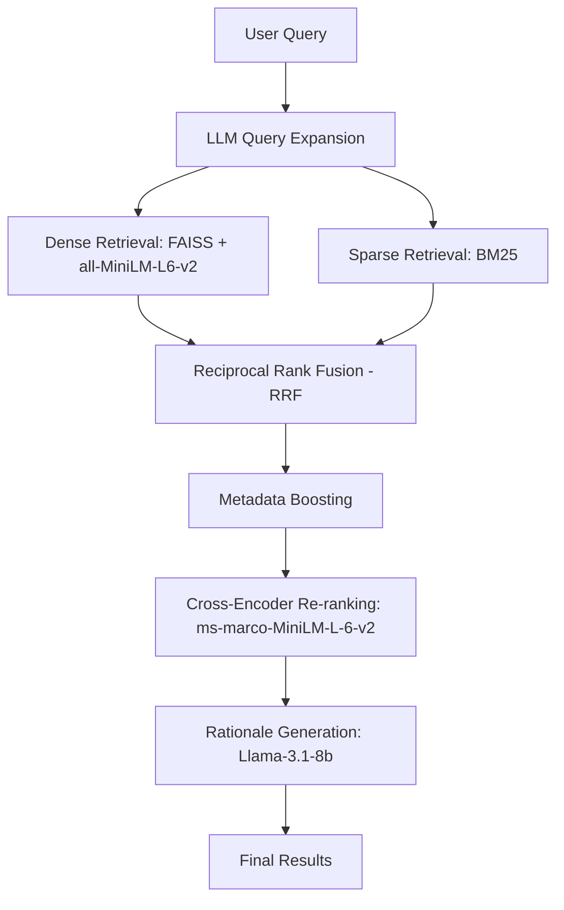

# BIS Standards Recommendation Engine
### BIS × Sigma Squad AI Hackathon | Track: AI / RAG

An AI-powered RAG pipeline that helps Indian MSEs find relevant BIS standards from a plain-language product description — in under 2 seconds.

---

## Table of Contents
1. [Quick Start](#quick-start)
2. [Full Setup Guide](#full-setup-guide)
3. [Running Inference (Judge Command)](#running-inference-judge-command)
4. [Running Evaluation](#running-evaluation)
5. [Running the UI](#running-the-ui)
6. [Project Structure](#project-structure)
7. [System Architecture](#system-architecture)
8. [Dataset & Chunking Strategy](#dataset--chunking-strategy)
9. [Modifying the Input Dataset](#modifying-the-input-dataset)
10. [Environment Variables](#environment-variables)
11. [Troubleshooting](#troubleshooting)
12. [Public Test Set Results](#public-test-set-results)

---

## Quick Start

```bash
# 1. Clone the repo
git clone <your-repo-url>
cd BIS

# 2. Install dependencies
pip install -r requirements.txt

# 3. (Optional) Add Groq API key for richer rationale in the UI
cp .env.example .env
# Edit .env: GROQ_API_KEY=your_key_here

# 4. Run inference (judge command)
python inference.py --input hidden_private_dataset.json --output team_results.json

# 5. Evaluate
python eval_script.py --results team_results.json
```

> **No model download required on first run.** The precomputed FAISS and BM25 indexes are included in this repo (`data/faiss.index`, `data/bm25.pkl`, `data/meta.pkl`). Only the query gets encoded at runtime (~50ms).

---

## Full Setup Guide

### Prerequisites

- Python 3.9 or higher
- pip
- ~500MB disk space (for sentence-transformer model cache)
- Internet connection for first run only (to download `all-MiniLM-L6-v2` and `ms-marco-MiniLM-L-6-v2` from HuggingFace)

### Step 1 — Install Python dependencies

```bash
pip install -r requirements.txt
```

All required packages are pinned in `requirements.txt`. No virtual environment is strictly required but recommended:

```bash
python -m venv venv
source venv/bin/activate   # Linux/Mac
venv\Scripts\activate      # Windows
pip install -r requirements.txt
```

### Step 2 — (Optional) Groq API key

The system works **fully without a Groq API key**. Retrieval accuracy and all automated metrics are unaffected. The API key only enables LLM-generated rationale text in the Streamlit UI.

To enable it:
```bash
cp .env.example .env
```
Edit `.env` and set:
```
GROQ_API_KEY=your_key_here
```
Get a free key at https://console.groq.com (free tier, no credit card required).

**Note:** `inference.py` intentionally disables the Groq API to avoid rate limits during batch processing. Groq is only used in `app.py` (Streamlit UI).

### Step 3 — Verify precomputed index

The following files should already be present in `data/`:
```
data/faiss.index    ← precomputed FAISS dense index (564 standards)
data/bm25.pkl       ← precomputed BM25 sparse index
data/meta.pkl       ← saved labels, texts, and metadata
```

If any of these are missing, rebuild them with:
```bash
python build_index.py
```
This takes ~20 seconds on first run and only needs to be done once.

---

## Running Inference (Judge Command)

```bash
python inference.py --input hidden_private_dataset.json --output team_results.json
```

**What this does:**
1. Loads precomputed index from disk (instant — no encoding)
2. For each query: runs hybrid retrieval → cross-encoder reranking → returns top-5 standards
3. Writes results to `team_results.json` in the required schema

**Expected output format:**
```json
[
  {
    "id": "Q-01",
    "query": "...",
    "retrieved_standards": ["IS 269 : 1989", "IS 8112 : 1989", ...],
    "latency_seconds": 1.52
  }
]
```

**No API key needed.** All steps in `inference.py` are local (no Groq calls).

---

## Running Evaluation

```bash
python eval_script.py --results team_results.json
```

Uses the organizer-provided `eval_script.py`. Outputs Hit Rate @3, MRR @5, and Avg Latency.

---

## Running the UI

```bash
streamlit run app.py
```

Opens at `http://localhost:8501`. The UI uses Groq (if key is set) to generate human-readable rationale for each retrieved standard. Without the key it falls back to chunk-derived text from BIS SP 21.

---

## Project Structure

```
BIS/
├── src/
│   └── rag_pipeline.py          # Core RAG pipeline (retrieval + reranking + rationale)
├── data/
│   ├── standards_chunks_enriched.json   # 564 enriched BIS standards (source of truth)
│   ├── standards_chunks.json            # Raw parsed standards (fallback)
│   ├── bis_docs.txt                     # Plain text fallback
│   ├── dataset.pdf                      # Source: BIS SP 21 (Building Materials)
│   ├── public_test_results.json         # Results on public test set
│   ├── faiss.index                      # ← Precomputed dense index (commit this)
│   ├── bm25.pkl                         # ← Precomputed sparse index (commit this)
│   └── meta.pkl                         # ← Saved labels + texts (commit this)
├── tests/
│   └── test_pipeline.py         # Unit tests
├── assets/
│   └── architecture.png         # Architecture diagram
├── inference.py                 # Judge entry point (no LLM, fully local)
├── build_index.py               # Rebuild indexes if missing
├── enrich_chunks.py             # One-time metadata enrichment script
├── extract_dataset.py           # One-time PDF parsing script
├── eval_script.py               # Organizer-provided evaluation script
├── app.py                       # Streamlit UI
├── requirements.txt             # Pinned dependencies
├── .env.example                 # API key template
└── README.md
```

---

## System Architecture


### Pipeline (per query)



### LLM Usage Summary

| Component | inference.py | app.py (UI) |
|-----------|-------------|-------------|
| Query Expansion | Disabled | Enabled (3s timeout) |
| Rationale | Disabled | Enabled (single batched call) |
| Retrieval | 100% local | 100% local |
| Re-ranking | 100% local | 100% local |

### Synonym Expansion

Before BM25 retrieval, abbreviations are expanded to full BIS terminology:

| Abbreviation | Expanded to |
|---|---|
| OPC | Ordinary Portland Cement |
| PPC | Portland Pozzolana Cement |
| PSC | Portland Slag Cement |
| SRC | Sulphate Resisting Cement |
| HAC | High Alumina Cement |
| AAC | Autoclaved Aerated Concrete |
| 33 GRADE | 33 Grade Ordinary Portland Cement |

### Metadata Boosting

Standards are enriched with boolean flags during preprocessing (`enrich_chunks.py`). During retrieval, query signals are matched against these flags to apply a +0.15 score boost per match (capped at +0.30):

| Flag | Triggered by query terms |
|---|---|
| is_lightweight | lightweight, aerated, cellular, autoclaved |
| is_slag_cement | slag, Portland slag, PSC |
| is_pozzolana | pozzolana, fly ash, PPC |
| is_white_cement | white + cement |
| is_rapid_hardening | rapid, rapid hardening |

---

## Dataset & Chunking Strategy

**Source:** BIS SP 21:2005 — Summaries of Indian Standards for Building Materials (PDF)

**Parsing:** `extract_dataset.py` parses the PDF page by page, identifies standard boundaries by IS number patterns (regex: `IS\s+\d+`), and creates one chunk per standard.

**Chunk structure:**
```json
{
  "label": "IS 269 : 1989",
  "text": "SP 21 : 2005 SUMMARY OF IS 269 : 1989 ORDINARY PORTLAND CEMENT ...",
  "metadata": {
    "category": "cement",
    "is_slag_cement": false,
    "is_pozzolana": false,
    "is_lightweight": false,
    "is_white_cement": false,
    "part": null
  }
}
```

**Why one chunk per standard?** BIS SP 21 provides compact summaries (100–300 words each) — these are already at the right semantic granularity. Splitting further would lose the standard number–content association. Merging would dilute relevance scores.

**Total chunks:** 564 BIS standards from the Building Materials category.

---

## Modifying the Input Dataset

### To update or replace the source PDF

1. Replace `data/dataset.pdf` with your new PDF
2. Run the parser:
   ```bash
   python extract_dataset.py
   ```
   This generates `data/standards_chunks.json`
3. Run enrichment to add metadata flags:
   ```bash
   python enrich_chunks.py
   ```
   This generates `data/standards_chunks_enriched.json`
4. Rebuild the index:
   ```bash
   python build_index.py
   ```

### To add custom standards manually

Edit `data/standards_chunks_enriched.json` directly. Each entry must follow:
```json
{
  "label": "IS XXXX : YYYY",
  "text": "Full standard summary text here...",
  "metadata": {}
}
```
Then rebuild the index with `python build_index.py`.

### To change the number of returned standards

Edit `inference.py` line:
```python
retrieved, _, latency = rag.query(item["query"], top_k=5)
```
Change `top_k=5` to any number between 1 and 20.

---

## Environment Variables

| Variable | Required | Description |
|---|---|---|
| `GROQ_API_KEY` | Optional | Groq API key for LLM rationale in UI. Get free at console.groq.com |

Copy `.env.example` to `.env` and fill in values. The system runs without any env vars set.

---

## Troubleshooting

**`ModuleNotFoundError: No module named 'rank_bm25'`**
```bash
pip install rank_bm25
```

**`FileNotFoundError: data/faiss.index`**
```bash
python build_index.py
```

**Slow first query (~20s)**
The sentence-transformer models download from HuggingFace on first use (~80MB). This only happens once — subsequent runs use the local cache. Ensure internet access on first run.

**`GROQ_API_KEY not set` warning in logs**
This is expected and safe. The system runs in retrieval-only mode. Retrieval accuracy is identical.

**`429 Too Many Requests` from Groq**
Only appears in `app.py` (UI). Does not affect `inference.py`. If it appears in the UI, queries are still processed correctly after the retry delay.

---

## Public Test Set Results

```
========================================
   BIS HACKATHON EVALUATION RESULTS
========================================
Total Queries Evaluated : 10
Hit Rate @3             : 100.00%   (Target: >80%)
MRR @5                  : 1.0000    (Target: >0.7)
Avg Latency             : 1.52 sec  (Target: <5 seconds)
========================================
```

Results file: `data/public_test_results.json`
