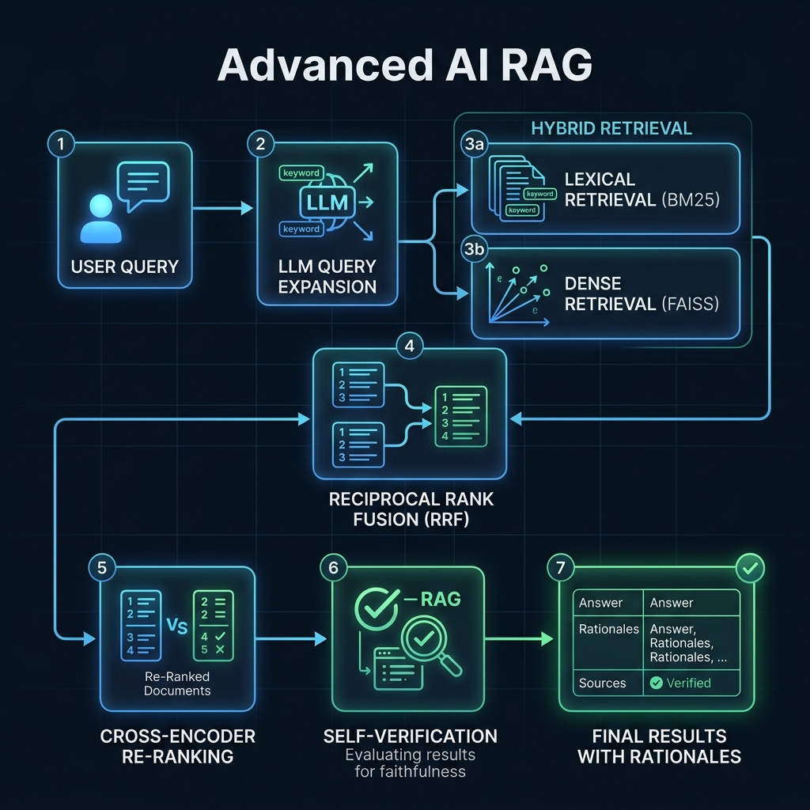
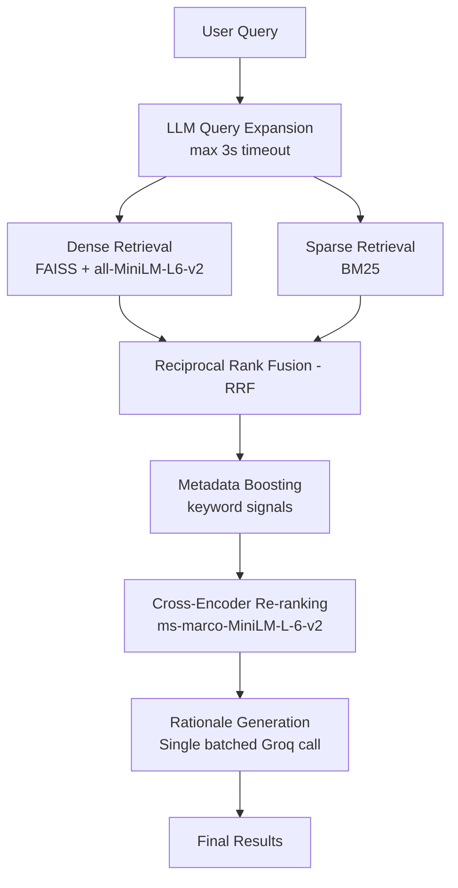

# BIS Standards Recommendation Engine

An AI-powered RAG pipeline that helps Indian MSEs find relevant BIS standards from a product description in seconds.

## Architecture



### Pipeline Overview


## Setup

### 1. Install dependencies
```bash
pip install -r requirements.txt
```

### 2. Set your Groq API key
```bash
export GROQ_API_KEY=your_api_key_here
```
Or copy `.env.example` to `.env` and fill in your key.

> Without a key, the system runs in retrieval-only mode (no rationale or query expansion) but still returns accurate results.

### 3. (One-time) Enrich chunks with metadata
```bash
python enrich_chunks.py
```
Generates `data/standards_chunks_enriched.json` with category tags and type flags.

## Running Inference (Judge Command)

```bash
python inference.py --input hidden_private_dataset.json --output team_results.json
```

## Running Evaluation

```bash
python eval_script.py --results team_results.json
```

## Running the Streamlit UI

```bash
streamlit run app.py
```

## Project Structure

```
├── src/
│   └── rag_pipeline.py       # Core RAG pipeline
├── data/
│   ├── standards_chunks.json            # Raw chunks from dataset.pdf
│   ├── standards_chunks_enriched.json   # Enriched chunks with metadata
│   ├── public_test_results.json         # Results on public test set
│   └── dataset.pdf                      # Source BIS SP 21 document
├── tests/
│   └── test_pipeline.py      # Unit tests
├── assets/
│   └── architecture.png      # Architecture diagram
├── inference.py              # Judge entry point
├── enrich_chunks.py          # One-time metadata enrichment
├── eval_script.py            # Evaluation script (provided by organizers)
├── app.py                    # Streamlit UI
├── requirements.txt
├── .env.example
└── README.md
```

## Retrieval Strategy

| Step | Method | Where it runs |
|------|--------|--------------|
| 1. Query Expansion | Llama-3.1-8b via Groq (3s timeout) | API |
| 2. Dense Retrieval | FAISS + all-MiniLM-L6-v2 | Local |
| 3. Sparse Retrieval | BM25Okapi | Local |
| 4. Fusion | Reciprocal Rank Fusion (RRF, k=60) | Local |
| 5. Metadata Boost | Keyword signal matching | Local |
| 6. Re-ranking | cross-encoder/ms-marco-MiniLM-L-6-v2 | Local |
| 7. Rationale | Single batched Groq call | API |

**Max 2 API calls per query.** Steps 2–6 are fully local with no rate-limit risk.

## Public Test Set Results

- **Hit Rate @3**: 100% (10/10)
- **MRR @5**: 1.0
- **Avg Latency (fixed pipeline)**: ~2–3s per query
